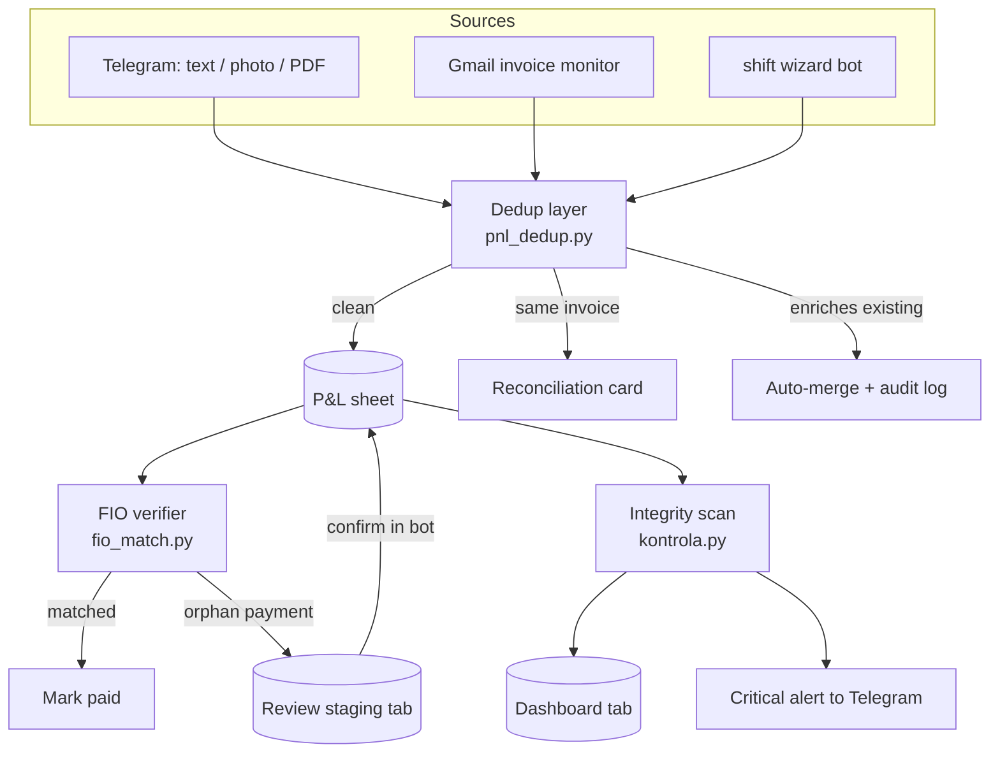

# Gastro P&L Automation

Telegram-native bookkeeping for a small restaurant. Two bots that turn the daily
mess of receipts, invoices, cash counts and a bank statement into a clean P&L
and a Czech-VAT-ready ledger, driven entirely from a phone.

> Working pilot, built solo for a real bar ("Demo Bistro" in this public copy).
> The core pipeline is implemented and unit-tested and runs in production against
> a Google Sheet. This repository is a sanitized portfolio copy: real client data,
> credentials and infrastructure details have been removed or replaced with
> placeholders.

## The problem

A small restaurant owner loses about 10 hours a month turning receipts, email
invoices, a card terminal export and daily cash counts into a spreadsheet, then
pays an accountant to make a VAT return out of it. The data comes from four or
five channels and nothing links them. Invoices get lost. Some go unpaid. The VAT
math is done by hand.

## What it does

- Captures expenses from free-form text, photos and PDFs in Telegram, and from
  email invoices, pulling out amount, supplier, date and VAT fields with an LLM
  and filing the document to Google Drive.
- Records daily shifts (revenue plus cash purchases) through a guided wizard bot.
- Reconciles against the bank (FIO Banka API). A 4-phase matcher ties payments to
  recorded expenses. Anything it cannot match is parked for review, never
  imported blindly.
- De-duplicates across channels, so the same invoice arriving by email and by
  photo does not get counted twice.
- Flags integrity problems (overdue, long-unpaid, paid-late, missing document) on
  an auto-rebuilt dashboard, and pushes only the critical ones to Telegram.

## Architecture

The datastore is a Google Sheet (the owner already lived in spreadsheets). The
bots are stateless workers around it.



### Design principle: pure cores, thin I/O

The logic that actually decides things (does this payment match an invoice, is
this a duplicate, what counts as an anomaly) lives in small, dependency-free
modules with full unit-test coverage. The bot files only do I/O (Google and
Telegram calls) on top of them.

| Pure module | Responsibility | Tests |
|---|---|---|
| `fio_match.py` | 4-phase bank-payment to invoice matching | 12 |
| `pnl_dedup.py` | cross-source duplicate / enrichment classification | 8 |
| `kontrola.py` | integrity anomaly scan (6 categories, forward-only) | 12 |
| `kasa/kalkulace.py` | proportional tip distribution (largest-remainder) | yes |

That split is the spine of the codebase. The orchestration files stay
replaceable, and the logic that matters is testable without a network.

## Tech stack

- Python 3.12, `python-telegram-bot` (async, JobQueue)
- Anthropic Claude for invoice and receipt field extraction (vision and text)
- Google Sheets / Drive / Gmail APIs
- FIO Banka REST API for bank statements
- pytest (asyncio), test-driven on the pure logic
- Runs as systemd services on a Linux VPS

## Project structure

```
telegram_bot.py     P&L bot: capture, reconcile, dashboard (I/O)
fio_match.py        pure: bank matching        + tests/test_fio_match.py
pnl_dedup.py        pure: dedup classification + tests/test_pnl_dedup.py
kontrola.py         pure: integrity scan       + tests/test_kontrola.py
kasa_bot.py         shift-closing wizard bot
kasa/               config, auth, sheets, drive, claude, notify, handlers/
  kalkulace.py      pure: tip math             + tests/test_kalkulace.py
tests/              unit tests over the pure cores
```

## Running the tests

```bash
pip install -r requirements.txt
python -m pytest -q       # pure-logic suite, fast, no network
```

The matching, dedup and integrity logic is driven test-first. Each module's tests
double as its spec.

## What I wrote vs what Claude wrote

I built this with Claude Code as a pair. The honest split:

- Mine: the product and the decisions. What the bots should do, the data model,
  the source-of-truth rules, the 4-phase matching design, the forward-only
  cutover, what counts as a duplicate or an anomaly, and every call on tradeoffs.
  Ten years in gastro is where the domain logic comes from.
- Claude's: most of the typing. Turning my decisions into Python, drafting tests
  once I described the cases, refactoring the pure cores out of the orchestration
  files, and catching bugs in review.

I treat it the way a senior dev treats a fast junior: I decide and review, the
tool executes. The pure modules and their tests are the clearest example of that
loop working.

## Status

Pipeline is built, unit-tested and running in production forward from go-live.
Next: an in-bot editing UI to remove the last reasons to touch the sheet by hand,
and continued decomposition of the largest orchestration file into focused I/O
modules (the pure cores above were the first slices pulled out of it).
